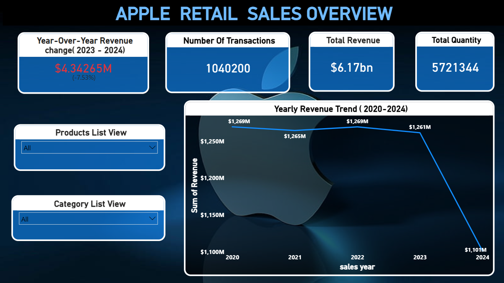
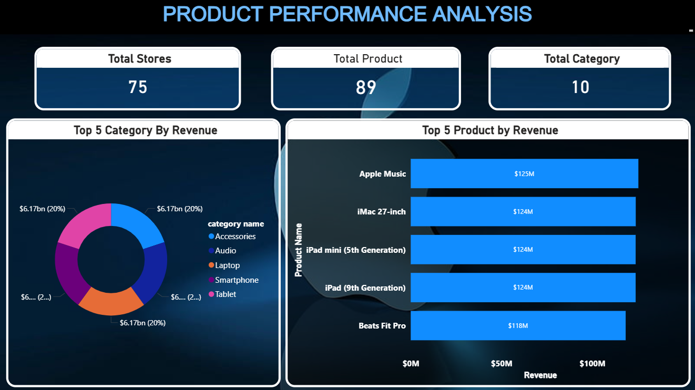
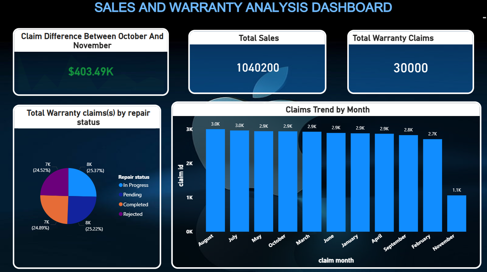
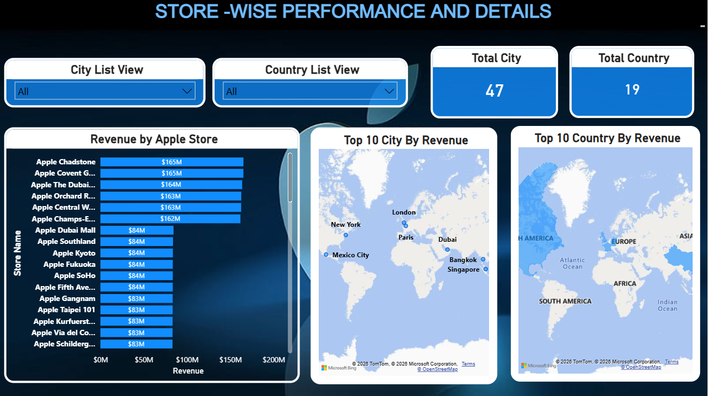

# Apple Retail Sales Overview 📊

## 📌 Project Overview
This project analyzes Apple retail sales data using Power BI to identify sales trends, product performance, and regional insights.

## 🎯 Objectives
- Analyze overall sales performance
- Identify top-performing products
- Understand regional sales trends
- Provide business insights for decision-making

## 🛠️ Tools Used
- Power BI
- Excel

## 📊 Dashboard Preview
### 1. Sales Overview

### 2. Product Performance

### 3. Sales & Warranty

### 4. Store Analysis

## 📊 Key Insights
- Sales trends over time
- Top-selling Apple products
- Region-wise performance
- Customer behavior patterns

## 📁 File Included
- Apple-Retail-Sales-Overview.pbix

## 👩‍💻 Author
Subaharini
